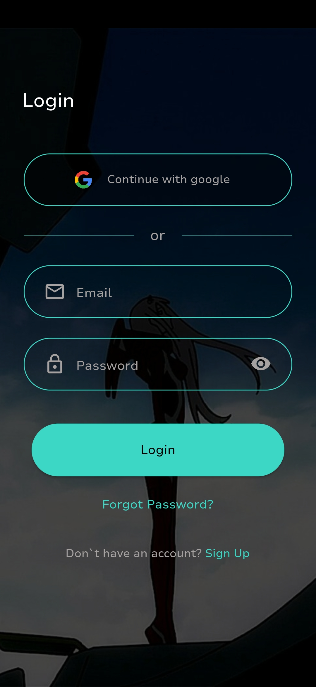
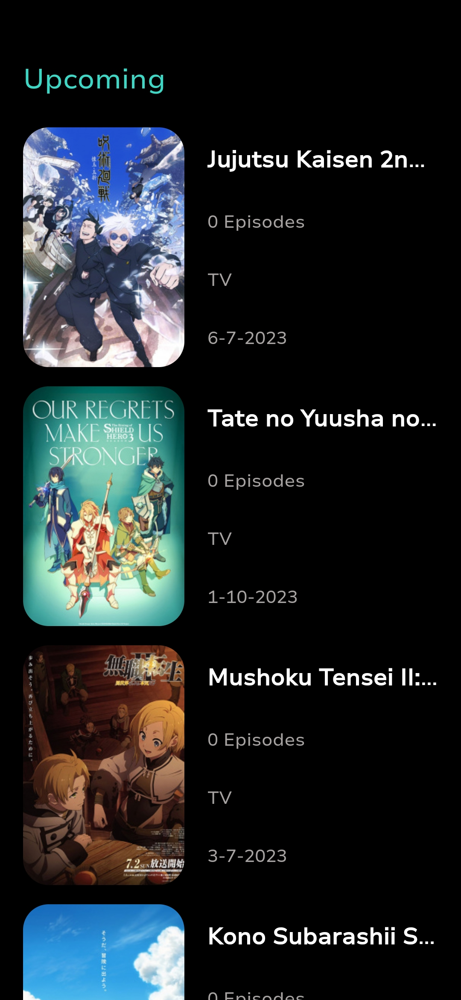
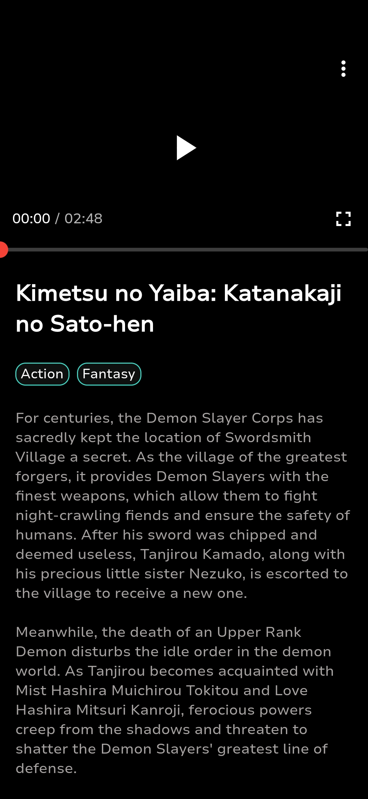
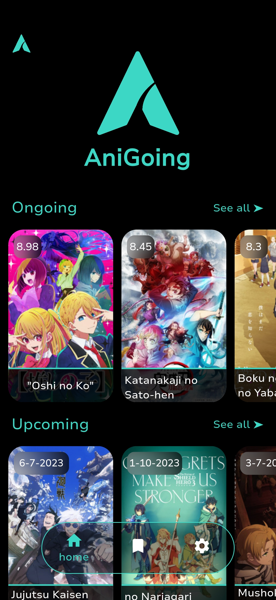

# AniGoing

## Description
AniGoing is an application that provides list ongoing anime on the season, and the upcoming anime

## App Screenshot
   

## what i use
- Getx as state manager
- Architectur MVC
- UI/UX reference https://www.behance.net/gallery/170123953/Anime-XD-(Anime-Streaming-App)
- Consume API from https://api.jikan.moe/v4/seasons/now and https://api.jikan.moe/v4/seasons/upcoming
- Firebase auth and firestore
