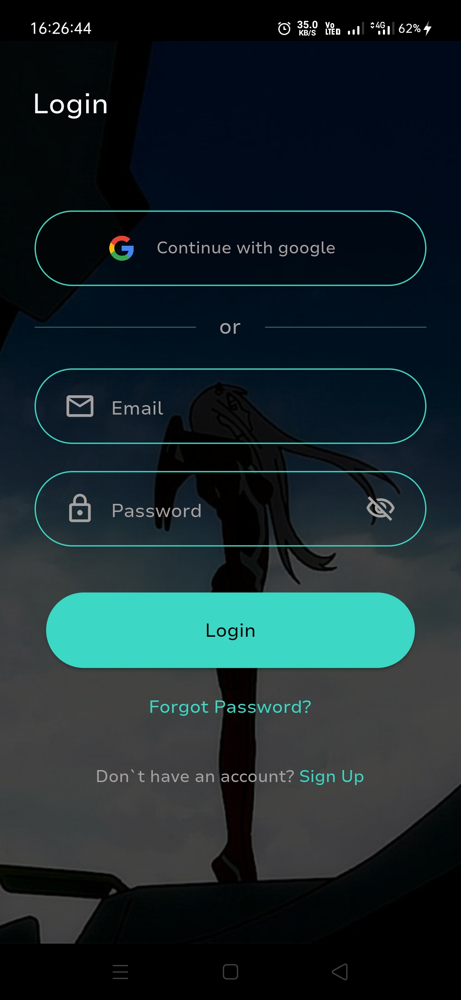
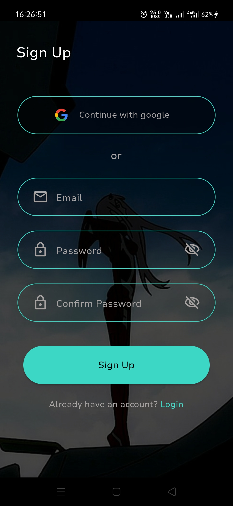
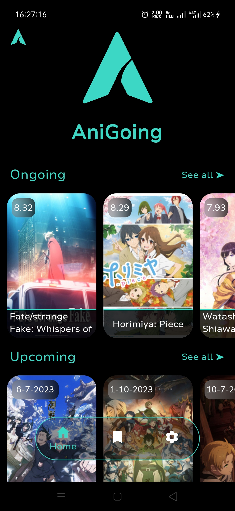
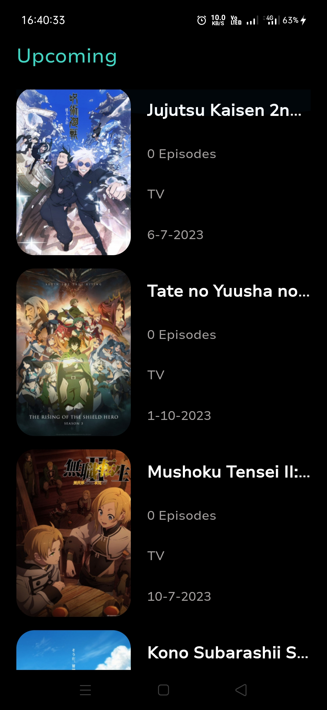
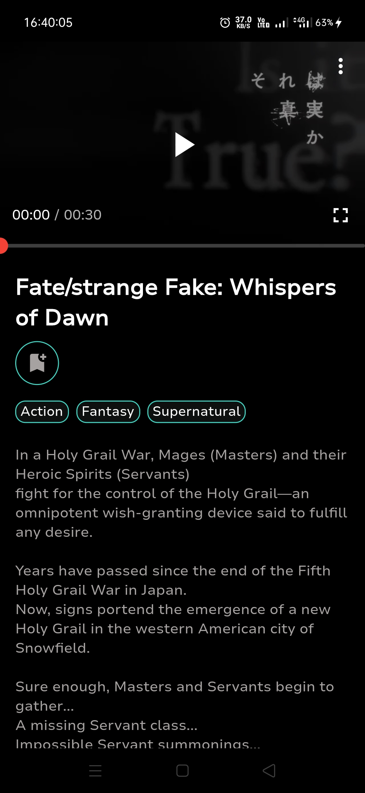
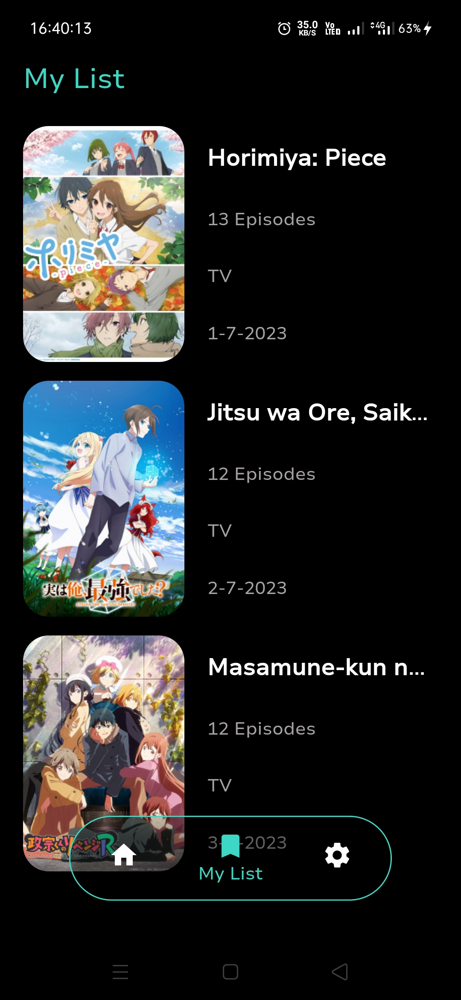

# ⚠️ Still on progress ⚠️ 

# AniGoing

## Description
AniGoing is an application that provides list ongoing anime on the season, and the upcoming anime

## Feature
- Authentication
- See ongoing or upcoming anime
- Play the anime trailer
- Add anime to My List
- Change language

## Screenshot

| Login        | Register    | Home        |
|--------------|-----------|-------|
|  |  |  |
| See All        | Detail    | My List        |
|  |  |  |

## What i`ve implemented
- Getx as state manager
- MVC Architecture
- Modularization
- Reusable widget
- Localization with Getx
- Consume API from https://jikan.moe/
- UI/UX reference https://www.behance.net/gallery/170123953/Anime-XD-(Anime-Streaming-App)
- Firebase auth, firestore, google sign in
- Local storage shared preferences
- Player library from https://pub.dev/packages/pod_player
- And other libiraries from https://pub.dev/
